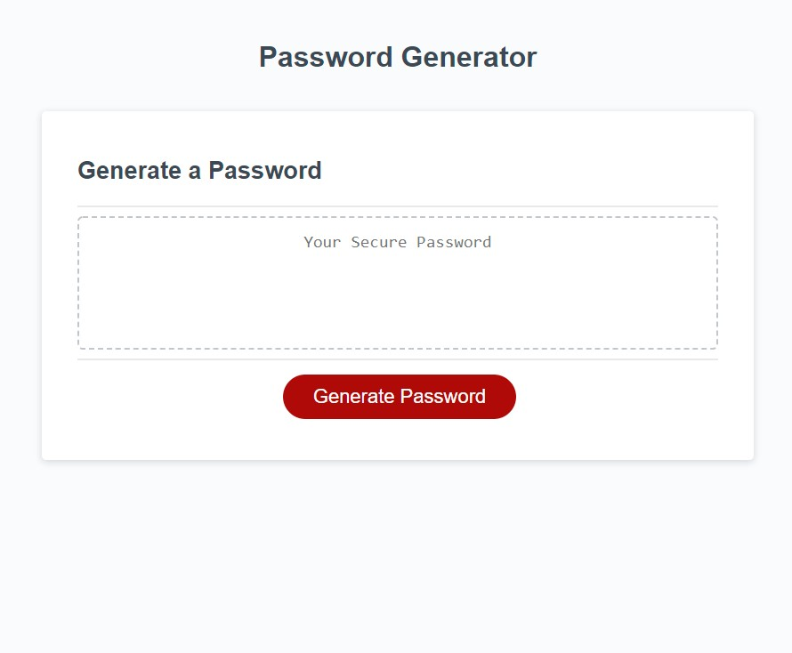

# password-generator

## Description

Small password generator for web site user and password credentials. Developed with JavaScript, this small responsive and dynamically updated page generates a user-configurable password. Limits minimum password size to 8 characters, a maximum of 128, and lets the user choose which character sets are employed when generating the password. Businesses implementing simple password security policies such as randomly generated passwords can reduce the likelihood of security breaches.

## Options

### Lowercase Characters

When enabling lowercase letters the list below is used when generating a password.

```md
abcdefghijklmnopqrstuvwxyz
```

### Uppercase Characters

When enabling Uppercase letters the list below is used when generating a password.

```md
ABCDEFGHIJKLMNOPQRSTUVWXYZ
```

### Numeric Characters

When enabling numeric letters the list below is used when generating a password.

```md
0123456789
```

### Special Characters

When enabling special letters the list below is used when generating a password. The space (" ") character has been included following [OWASP's](https://owasp.org/www-community/password-special-characters) recommendations. Please, note that if the password is being generated for [Oracle Identity Manager and/or Microsoft Active Directory](https://docs.oracle.com/cd/E11223_01/doc.910/e11197/app_special_char.htm#MCMAD416) the spaces may need to be removed or  special characters disabled.

```md
 !"#$%&'()*+,-./:;<=>?@[\\]^_`{|}~
```

## Link

Link to [github-pages](https://graybishop.github.io/password-generator/) deployment.

## Screenshot



## Tech Stack

* HTML5
* CSS3
* JavaScript
